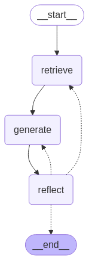

# **RAG Chatbot - README**

# High-Level Design and Solution Approach 

## Workflow Diagram

## 1. Overview
This Python file implements a Streamlit-based chatbot that performs Retrieval-Augmented Generation (RAG) using Qdrant vector store and Google Generative AI embeddings. It extracts text from PDFs (including images via OCR), stores vectorized text chunks, and enables users to chat with the system using an authentication mechanism.  
Below is the high-level workflow of the chatbot system:  
<p align="center">
  
</p>

## 2. High-Level Design
The application consists of the following main components:

### A. User Authentication Module
- Maintains user credentials in a JSON file (`users.json`).
- Supports registration and login functionality.
- Uses session state to store authentication status.

### B. PDF Processing Module
- Extracts raw text from PDFs using `PyPDF2`.
- Extracts images from PDFs using `pdf2image`.
- Uses `pytesseract` OCR to extract text from images.
- Combines extracted text and image text for further processing.

### C. Text Processing and Chunking
- Splits the extracted text into manageable chunks using LangChain's `RecursiveCharacterTextSplitter`.

### D. Vector Store and Embeddings
- Uses Google Generative AI for text embeddings.
- Stores the vectorized chunks in a Qdrant collection for retrieval.
- Searches Qdrant for relevant document chunks based on user queries.

### E. RAG Workflow (Using LangGraph)
- **Retrieve Node**: Fetches relevant document chunks from Qdrant.
- **Generate Node**: Generates a response using the retrieved context and user query.
- **Reflection Node**: Evaluates response accuracy and suggests corrections if needed.
- **Workflow Execution**: Runs the graph-based execution pipeline.

### F. Streamlit Chat Interface
- Displays chat history.
- Processes user input and interacts with the chatbot.
- Handles real-time chat streaming.

## 3. Solution Approach
The solution follows a structured approach:

### Step 1: Authentication Handling
- If the user is not authenticated, the system presents a login/register UI.
- Upon successful authentication, the system initializes the chatbot.

### Step 2: PDF Data Processing
- Loads a predefined PDF.
- Extracts and preprocesses text from both text-based and image-based content.
- Splits text into chunks for embedding.

### Step 3: Vector Store Initialization
- Converts text chunks into embeddings using Google Generative AI.
- Stores them in Qdrant for efficient retrieval.

### Step 4: Chatbot Workflow Execution
- The chatbot retrieves relevant document chunks based on user queries.
- Generates responses using Google GenAI.
- Reflects on the response accuracy and refines if necessary.


### Step 5: Reflect Node and Retrieval Process

#### Scenarios:

#### 5.1. **Only Generation Runs Again**
- **Condition**: AI’s response is slightly wrong, but the retrieved documents were correct.
- **Example**:  
  **User asks**: "What is the capital of India?"  
  - Retrieval fetches: "New Delhi is the capital of India."
  - AI responds: "Delhi is the capital of India."
  - Reflect detects a minor error but keeps the question unchanged. The system only regenerates the response, correcting it to "New Delhi."

**Why**: Retrieval is skipped because the retrieved documents were correct. The error was in the AI's generation.


#### 5.2. **Both Retrieval and Generation Run Again**
- **Condition**: AI’s response is incorrect because the retrieved documents were incomplete or irrelevant.
- **Example**:  
  **User asks**: "What is Einstein’s equation?"  
  - Retrieval fetches: "Einstein was a famous physicist" (no mention of the equation).
  - AI responds: "Einstein's equation is about relativity."
  - Reflect suggests better wording: "Explain Einstein’s famous equation E = mc²."
  - Retrieval is done again with the new query, and AI generates the correct answer: "E = mc² is Einstein’s mass-energy equivalence equation."

**Why**: Retrieval is triggered again because the original documents were incomplete. Reflection suggested a new question, leading to better results.

---

#### Summary
| **Condition**                                                      | **Action**                                              |
|--------------------------------------------------------------------|---------------------------------------------------------|
| AI's response is slightly wrong, but retrieved docs were fine      |  **Only generation runs again** (retrieval skipped)   |
| AI's response is wrong due to incomplete or irrelevant docs       |  **Both retrieval and generation run again**          |


### Step 5: Streamlit UI Interaction
- Displays chat history and responses dynamically.
- Allows users to clear chat history.
- Supports live response streaming.

## 4. Key Technologies Used
- **Streamlit**: UI for chatbot and authentication.
- **PyPDF2 / pdf2image / pytesseract**: PDF text and image extraction.
- **LangChain**: Text processing, chunking, and document retrieval.
- **Qdrant**: Vector database for storing and searching embeddings.
- **Google Generative AI**: Embeddings and chat generation.
- **LangGraph**: Graph-based execution flow for chatbot reasoning.


---

## **RAID Matrix**


| **ID** | **Description** | **Mitigation/Action Plan** |
|--------|---------|-----------------------------|
| **R1** | Data Security Risk: User credentials stored in JSON are not secure. | Implement **hashed passwords** (bcrypt) and consider **OAuth authentication**. |
| **R3** | Slow Response Time: Large PDFs can cause delays. | Optimize chunking strategy and cache embeddings for frequent queries. |
| **A1** | Users upload clear, readable PDFs. | Provide error handling for invalid PDFs and notify users about poor-quality images. |
| **I1** | Incorrect retrieval: Retrieved documents may not be contextually relevant. | Improve **vector search ranking** with metadata-based filtering. |
| **I3** | Authentication Bypass: JSON-based authentication is insecure. | Use **hashed passwords** and consider database-backed authentication. |
| **D1** | Google Generative AI: Used for embeddings and responses. | Ensure alternative APIs (e.g., OpenAI, Hugging Face) are available. |
| **D2** | Qdrant Vector Store: Required for document retrieval. | Implement a **backup vector store** (FAISS, Weaviate). |

---

## **Installation**

1. Clone the repository:
   ```bash
   https://github.com/Harsh-Kapoor7/GraphRAG-Task.git
   cd RAG-chatbot
   ```

2. Create a virtual environment:
   ```bash
   python -m venv venv
   source venv/bin/activate  (for linux)
   ```

3. Install dependencies:
   ```bash
   pip install -r requirements.txt
   ```

4. Start the chatbot:
   ```bash
   streamlit run main.py
   ```

---

## **Usage**
- Upload a PDF document.
- Ask questions related to the document.
- The chatbot will retrieve relevant information using **Qdrant** and **Google Generative AI**.

---
